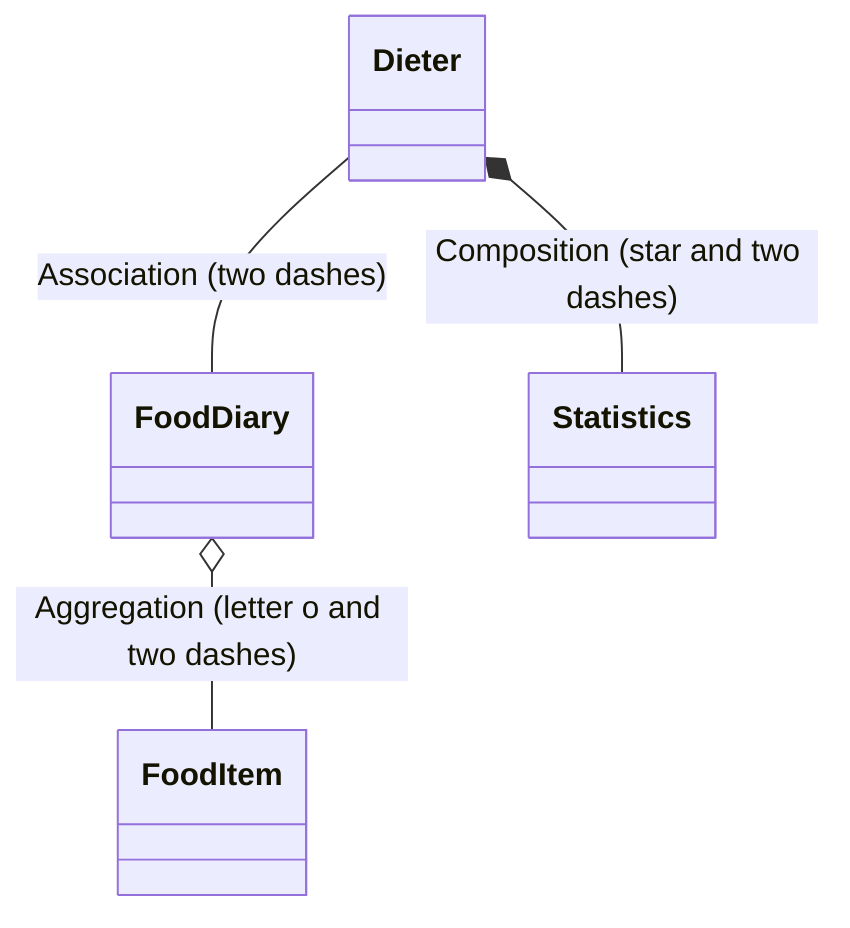
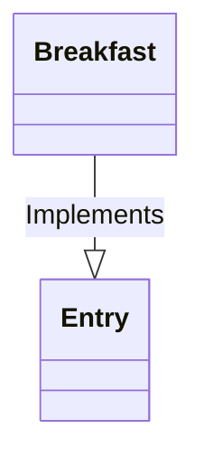

# ids-mermaiddemo
Domain modelling is useful in establishing entities and bounded contexts. Domain Driven Design is a natural partner for developing Microservices and Mermaid is a useful tool for creating diagrams right within your DevOps/Gihub repo or Wiki.

## Note on the example
For simplicity this readme uses a simple contrived model of a diet and excercise app. 

## Domain modelling with Mermaid
Mermaid has class diagram syntax which can be used to model the domain. Classes are used to represent entities.

## Basic domain model syntax
You can use the following class diagram to represent entities and their relationships. 
```
mermaid
classDiagram-v2
Dieter -- FoodDiary : Association
Dieter *-- Statistics : Composition
FoodDiary o-- FoodItem : Aggregation
```
## Relationship types
The entities (classes) above have three different relationships. For example the dieters weight does not exist without the dieter but a food item can be a favourite for reuse or an entry in the food diary.
* Association (each object holds a reference to another) -- shown with a line.
* Composition (child does not exist without parent) *-- shown with a solid diamond.
* Aggregation (object can exitst without the other) o-- shown with a white filled diamond.

Text after the colon describes the relationship. 

## Diet App Domain Model (first iteration)
Using this we can scaffold out the first attemp at a domain model. 
__Note__ some of the relationships have been refined. During modelling some of the entities may become properties of other entities.
```mermaid
classDiagram-v2
    Dieter -- FoodDiary
    Dieter -- Statistics
    Dieter *-- Favourites

    FoodDiary *-- Day

    Entrys o-- Ingredients
    Entrys o-- Favourites

    Favourites o-- Ingredients

    Ingredients o-- NutritionInfo

    Snacks o-- Ingredients
    Snacks o-- Favourites
    
    Statistics *-- Weights
    Statistics *-- WaistMeasurements

    Day o-- Entrys
    Day o-- Snacks
 ```
 ## Adding more detail
You can add multiplicity and more detail to the relationships. Cardinality is added at the end of the relationship e.g.
```
    Dieter "1" --> "0..*" Statistic : Tracks their
``` 
A dieter has 0 or more statistics and statistics belong to one dieter. Entities are shown as singular and more detail on the relationship is shown by adding text after the colon.  

Specializations can be shown with 
```
   Breakfast --|> Entry : Implements
```

Using all the above the diagram can be expanded as below.

 ```mermaid
 ---
 title: Diet App
 ---
classDiagram-v2
    Dieter "1" --> "1" FoodDiary : Keeps a
    Dieter "1" --> "0..*" Statistic : Tracks their
    Dieter "1" *-- "0..*" Favourite : Saves 
    
    FoodDataBank "1" -- "1..*" FoodItem : Is made up of

    FoodDiary "1" *-- "1..*" Day : Made up of

    Entry o-- FoodItem : Implements

    Breakfast --|> Entry : Implements
    Lunch --|> Entry : Implements
    Dinner --|> Entry : Implements
    Snack --|> Entry : Implements

    Day "1" o-- "1" Breakfast  : Has
    Day "1" o-- "1" Lunch : Has
    Day "1" o-- "1" Dinner : Has
    Day "1" o-- "1..*" Snack : Has

    Favourite o-- FoodItem : Implements

    FoodItem o-- NutritionInfo : Has
    
    Weight --|> Statistic : Is a kind of
    WaistMeasurement --|> Statistic : Is a kind of
    
 ```
