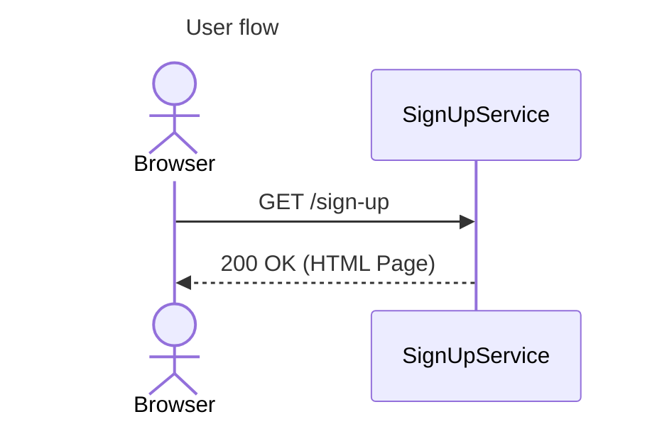
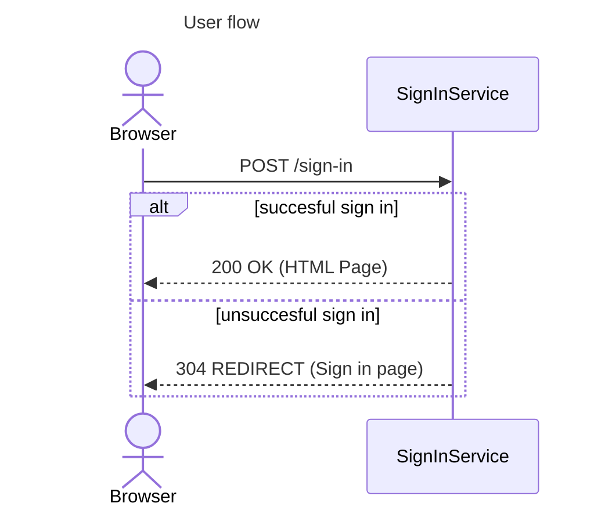
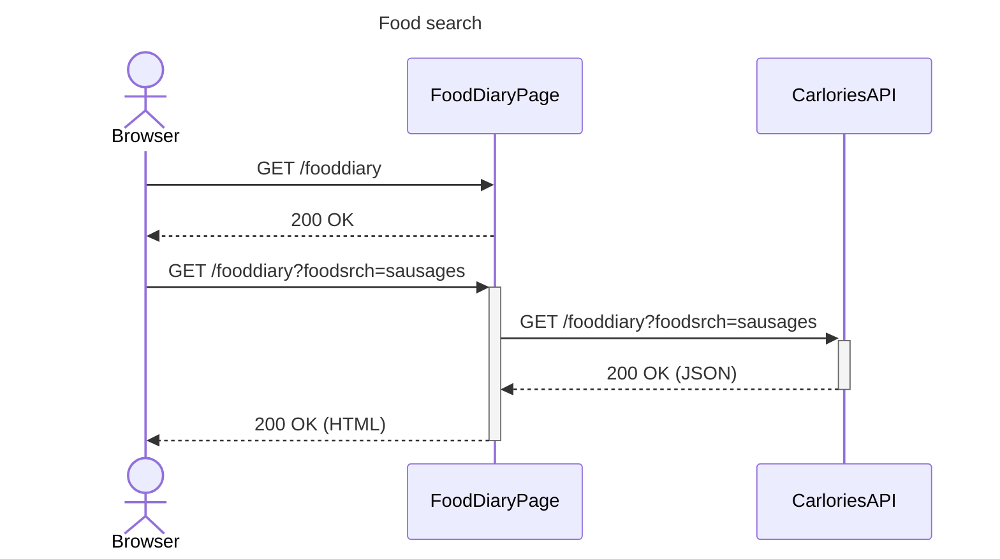
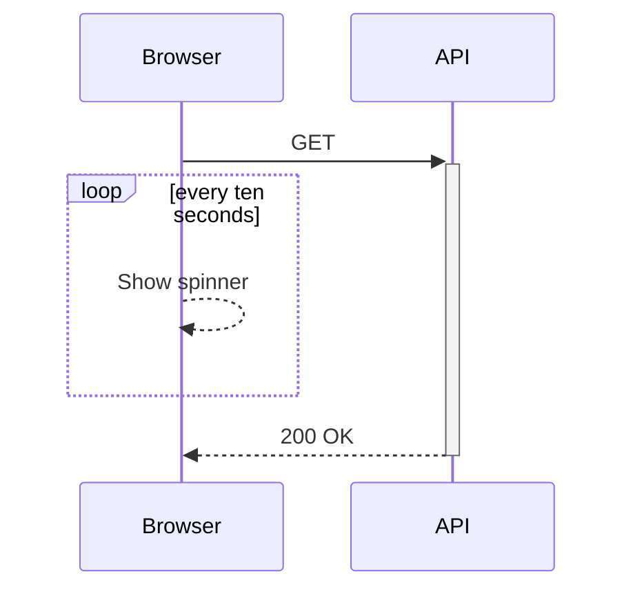

# User Flows
Mermaid diagrams can be used to embed user flow (UML sequence) diagrams within your DevOps Wiki or README files. 

## Basic syntax
As with all Mermaid diagrams we start with the mermaid declaration (not shown in the text) and add an optional title. Participants dont have to declared but it helps control the order. Messages are shown by writing the sender, a symbol, the receiver and then optional text.
```
---
title : User flow
---
sequenceDiagram
   actor Browser
   participant SignUpService

   Browser ->> SignUpService : GET /sign-up
   SignUpService -->> Browser:200 OK (HTML Page)
```
Synchronous messages are shown with a dash and two gt symbols (->>)
Synchronous replies are shown with two dases and two gt symbols (-->>). 
__Note__ the arrows are shown in the same direction but the participants are reversed. 


## Branching logic
Branching logic can be shown by adding alt/else blocks
```
---
title : User flow
---
sequenceDiagram
   actor Browser
   participant SignInService

   Browser ->> SignInService : POST /sign-in
   alt succesful sign in
      SignInService -->> Browser:200 OK (HTML Page)
   else unsuccesful sign in
      SignInService -->> Browser:304 REDIRECT (Sign in page)
   end
``` 

### Lifecycle activation
With Mermaid you can show lifecycle with either shor or long syntax. 

By adding plus and minus to participants at the receiving edge we can control lifecycle
```
---
title: Food search
---
sequenceDiagram
   actor Browser
   participant FoodDiaryPage
   participant CarloriesAPI

   Browser ->> FoodDiaryPage : GET /fooddiary
   FoodDiaryPage -->> Browser : 200 OK
   Browser ->> +FoodDiaryPage : GET  /fooddiary?foodsrch=sausages
   FoodDiaryPage ->> +CarloriesAPI : GET /fooddiary?foodsrch=sausages
   CarloriesAPI -->> -FoodDiaryPage : 200 OK (JSON)
   FoodDiaryPage -->> -Browser : 200 OK (HTML)
```

You can use the loop syntax to show iterations
```
   loop every ten seconds
      Browser -->> Browser : Show spinner
   end
```



